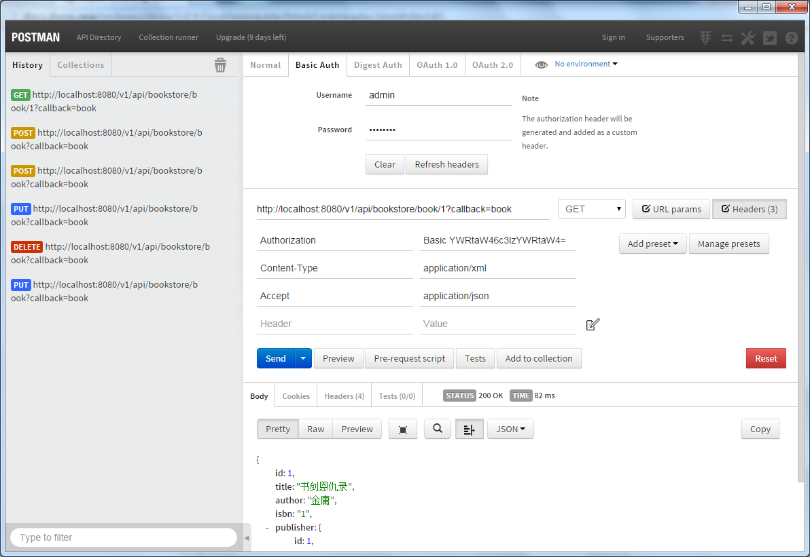

resteasy-helloworld-example
======================

基于resteasy的restfull api接口示例

实现的功能:

* 基于POST、GET、PUT、DELETE请求响应的REST full服务

* 多元化的数据响应,同一请求可返回json、jsonp、xml三种格式的响应数据 

* 基于http basic认证(参考web.xml和tomcat-users.xml的配置),同时基于@RolesAllowed注解

* 基于HttpURLConnection的客户端调用

* 基于httpclient的客户端调用

* 基于ResteasyClient的客户端调用

# Java EE安全配置参考文档

[http://docs.oracle.com/javaee/6/tutorial/doc/gkbaa.html](http://docs.oracle.com/javaee/6/tutorial/doc/gkbaa.html)

# 与我联系

* QQ:*184675420*

* Email:*sxyx2008#gmail.com*(#替换为@)

* HomePage:*[aimeizi.net](http://aimeizi.net)*

* Weibo:*[http://weibo.com/qq184675420](http://weibo.com/qq184675420)*(荧星诉语)

* Twitter:*[https://twitter.com/sxyx2008](https://twitter.com/sxyx2008)*

# License

MIT

Copyright (c) 2014 雪山飞鹄
